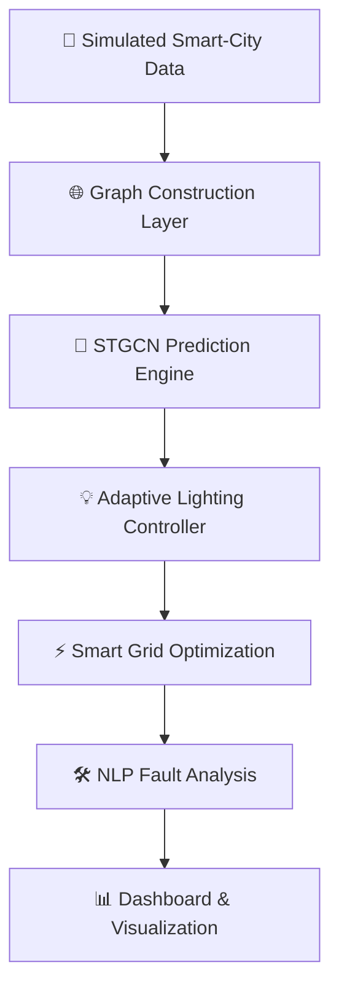

<div align="center">

# 🌃 Luminia Smart Grid
### *AI-Powered Smart City Infrastructure Platform*

<p align="center">
  
  
  
  
  
</p>

---

<h3>💡 Predict • Optimize • Illuminate</h3>

<p>
Luminia Smart Grid is a fully integrated AI-powered smart city platform combining Graph Neural Networks, adaptive lighting, smart-grid optimization, and intelligent infrastructure analytics to simulate next-generation urban systems.
</p>

---


</div>

---

# ⚡ Overview

**Luminia Smart Grid** is an advanced smart-city AI platform designed to optimize urban lighting, energy efficiency, and infrastructure intelligence through graph-based machine learning and predictive analytics.

The platform integrates:

- 🧠 Spatio-Temporal Graph Neural Networks (STGCN)
- 🌆 Urban traffic prediction
- 💡 Adaptive street lighting
- ⚡ Smart-grid optimization
- 🛠️ NLP-based fault analysis
- 🌐 Graph-based infrastructure modeling
- 📊 Real-time dashboard visualization

---

# 🚀 Core Features

## 🌉 Intelligent Graph Infrastructure

The entire city is modeled as a dynamic graph containing:

- Lamp posts
- Roads
- Intersections
- Electrical grids
- Urban sectors
- Infrastructure nodes

---

## 🧠 AI Traffic Prediction Engine

Predicts:

- 🚶 Pedestrian movement
- 🚗 Vehicle flow
- 🌃 Urban activity patterns
- 📈 Temporal traffic evolution

Using:
- STGCN
- Spatial graph learning
- Temporal forecasting

---

## 💡 Adaptive Lighting System

Dynamically adjusts streetlight intensity based on:

- Predicted traffic density
- Environmental conditions
- Time-based demand
- Energy optimization policies

Benefits:
- ⚡ Reduced energy consumption
- 🌱 Sustainable infrastructure
- 🌃 Intelligent urban illumination

---

## ⚙️ Smart Grid Optimization

Optimizes:
- Electrical topology
- Energy distribution
- Infrastructure efficiency
- Maintenance routing

Algorithms:
- Kruskal Minimum Spanning Tree
- Bellman-Ford Shortest Path

---

## 🛠️ NLP Fault Intelligence

Analyzes infrastructure reports using Natural Language Processing:

- Short circuits
- Voltage anomalies
- Lamp failures
- Grid instability
- Maintenance alerts

---

## 📊 Real-Time Dashboard

Interactive visualization platform featuring:

- Smart-city graph topology
- Traffic heatmaps
- Lighting states
- Energy analytics
- Infrastructure monitoring
- System metrics

---

# 🏗️ System Architecture



---

# 🧪 Simulated Smart-City Environment

The platform operates using realistic synthetic urban datasets including:

| Data Type | Description |
|---|---|
| 🚗 Traffic Data | Vehicle flow simulation |
| 🚶 Pedestrian Data | Human movement patterns |
| ⚡ Energy Data | Smart-grid consumption |
| 🌦️ Weather Data | Environmental conditions |
| 🛠️ Fault Reports | Infrastructure anomalies |
| 💡 Lamp States | Dynamic lighting states |
| 🌐 Graph Topology | Urban connectivity |

---

# 🛠️ Tech Stack

<div align="center">

| AI / ML | Graph Systems | Backend | Visualization |
|---|---|---|---|
| PyTorch | NetworkX | Python | Streamlit |
| STGCN | PyTorch Geometric | FastAPI | Plotly |
| Transformers | Neo4j | Pandas | Power BI |

</div>

---

# 📂 Project Structure

```bash
Luminia-Smart-Grid/
│
├── data/               # Simulated datasets
├── graph/              # Graph construction & topology
├── models/             # STGCN and AI models
├── optimization/       # Smart-grid optimization
├── nlp/                # Fault analysis module
├── dashboard/          # Visualization interface
├── notebooks/          # Research experiments
└── docs/               # Documentation
```

---

# 📈 Development Progress

```text
█████████████████████████ 100%
```

- [x] Smart-city simulation environment
- [x] Synthetic data generation
- [x] System architecture design
- [x] Graph construction
- [x] STGCN implementation
- [x] Adaptive lighting engine
- [x] Grid optimization layer
- [x] NLP fault analysis
- [x] Dashboard visualization

---

# 🎯 Objectives

✔ Improve urban energy efficiency  
✔ Reduce unnecessary lighting consumption  
✔ Build intelligent adaptive infrastructure  
✔ Optimize smart-grid operations  
✔ Explore graph AI for smart cities  
✔ Simulate scalable future-city systems  

---

# 📊 Research Domains

This project explores the intersection of:

- Smart Cities
- Graph Neural Networks
- Energy AI
- Predictive Infrastructure
- Sustainable Computing
- Urban Intelligence
- Intelligent Transportation Systems

---

# 🔮 Future Enhancements

- 🌐 Real-time IoT integration
- 🤖 Reinforcement learning optimization
- 🛰️ Edge AI deployment
- 🏙️ Digital twin simulation
- ⚡ Real-time smart-grid orchestration
- 🔐 Infrastructure cybersecurity

---

# 🌟 Vision

> *Luminia Smart Grid aims to redefine urban infrastructure through intelligent, adaptive, and sustainable AI-driven systems.*


<div align="center">

# 🌃 Luminia Smart Grid
### ⚡ Building the Intelligence Behind Future Cities ⚡

</div>
