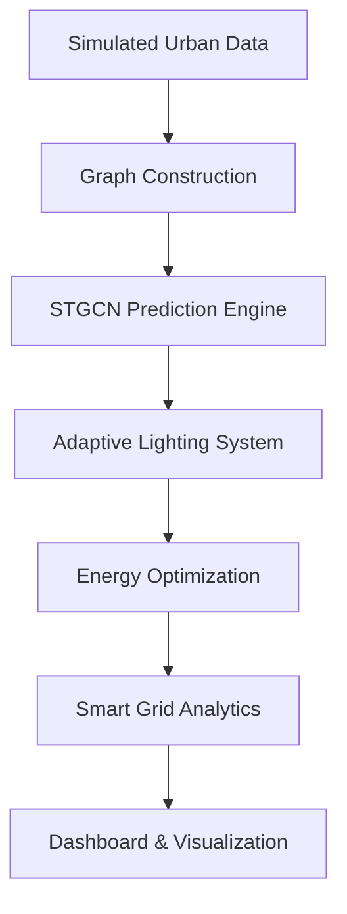

<div align="center">

# ⚡ Luminia Smart Grid
### *AI-Powered Smart City Infrastructure Platform*


---

### 🌆 Predict • Optimize • Illuminate

*An intelligent smart-city platform using Graph Neural Networks, adaptive lighting, and smart-grid optimization to build the next generation of urban infrastructure.*

</div>

---

# ✨ Overview

**Luminia Smart Grid** is a futuristic AI-powered smart city system designed to simulate and optimize urban energy infrastructure.

The platform combines:

- 🧠 Graph Neural Networks (STGCN)
- ⚡ Smart-grid optimization
- 🌃 Adaptive public lighting
- 📊 Predictive traffic analytics
- 🛠️ NLP-based fault analysis
- 🌐 Graph-based infrastructure intelligence

---

# 🚀 Core Features

## 🌉 Graph-Based City Modeling
Represent the city as a dynamic graph of:
- Lamp posts
- Roads
- Intersections
- Electrical connections

---

## 🧠 AI Traffic Prediction
Predict:
- Pedestrian flow
- Vehicle density
- Urban activity patterns

Using:
- **STGCN**
- Temporal forecasting
- Spatial graph learning

---

## 💡 Adaptive Lighting Engine
Dynamically adjust streetlight intensity based on:
- Predicted traffic
- Weather conditions
- Time of day
- Energy demand

---

## ⚡ Smart Grid Optimization
Optimize:
- Electrical topology
- Energy distribution
- Maintenance routing
- Power efficiency

Algorithms:
- Kruskal MST
- Bellman-Ford

---

## 🛠️ Intelligent Fault Detection
Analyze maintenance reports using NLP:
- Short circuits
- Lamp failures
- Voltage anomalies
- Infrastructure alerts

---

# 🏗️ System Architecture



---

# 🧪 Simulated Data Environment

The platform currently uses realistic synthetic data including:

- 🚗 Traffic flow
- 🚶 Pedestrian activity
- ⚡ Energy consumption
- 🌦️ Weather conditions
- 🛠️ Maintenance reports
- 🌃 Lamp states
- 🔌 Electrical topology

---

# 🛠️ Tech Stack

| Category | Technologies |
|---|---|
| AI / ML | PyTorch, STGCN |
| Graphs | NetworkX, PyTorch Geometric |
| Backend | Python |
| Data | Pandas, NumPy |
| Visualization | Streamlit, Plotly |
| Database | Neo4j, PostgreSQL |

---

# 📂 Project Structure

```bash
Luminia-Smart-Grid/
│
├── data/               # Simulated datasets
├── graph/              # Graph construction & topology
├── models/             # STGCN and ML models
├── optimization/       # Graph optimization algorithms
├── nlp/                # Fault analysis module
├── dashboard/          # Smart city visualization
├── notebooks/          # Research experiments
└── docs/               # Documentation
```

---

# 📈 Current Progress

- [x] Smart-city simulation environment
- [x] Synthetic dataset generation
- [x] System architecture design
- [ ] Graph construction
- [ ] STGCN implementation
- [ ] Adaptive lighting engine
- [ ] Energy optimization module
- [ ] NLP fault analysis
- [ ] Dashboard system

---

# 🎯 Objectives

✔ Improve urban energy efficiency  
✔ Reduce unnecessary lighting consumption  
✔ Predict urban activity using Graph AI  
✔ Simulate intelligent infrastructure systems  
✔ Explore scalable smart-city technologies  

---

# 🔮 Future Roadmap

- 🌐 Real-time IoT integration
- 🤖 Reinforcement learning optimization
- 🛰️ Edge AI deployment
- 🏙️ Digital twin simulation
- ⚡ Real-time energy orchestration
- 🔐 Smart-grid cybersecurity

---

# 🧠 Research Focus

This project explores the intersection of:

- Smart Cities
- Graph Neural Networks
- Energy AI
- Urban Intelligence
- Predictive Infrastructure
- Sustainable Computing

---

<div align="center">

## 🌃 Luminia Smart Grid
### *Building the Intelligence Behind Future Cities*

</div>
